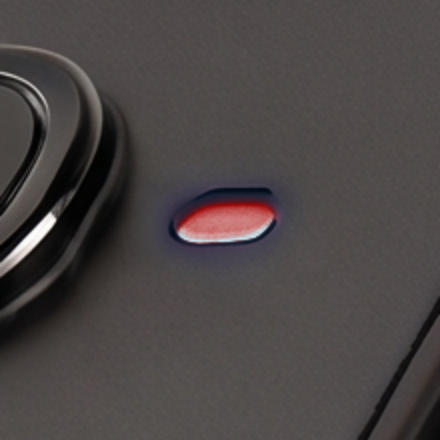
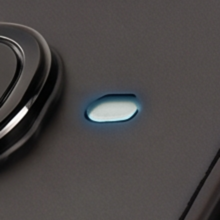
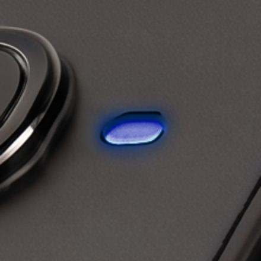
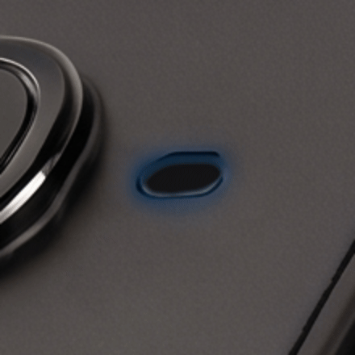
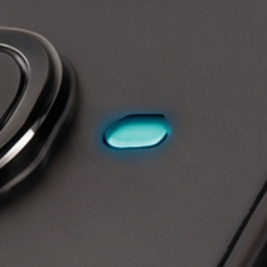
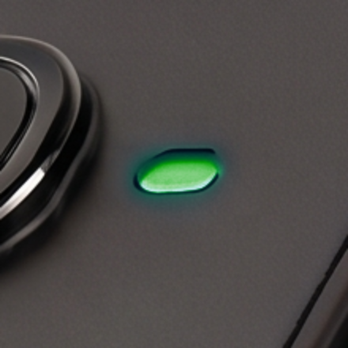
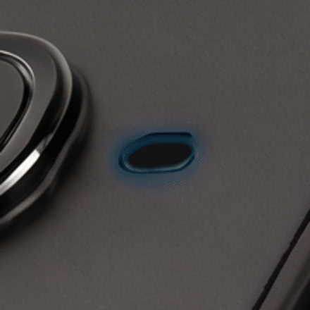
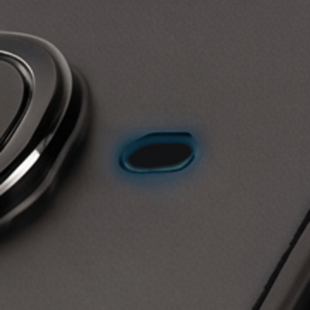

# Supported devices

The SDK supports two hardware models, both exposed as a shared
`MudraDevice` API with a small set of model-specific extras:

- **Mudra Pro** (`MudraPro`) — 3-channel EMG (ADS1293 AFE).
- **Mudra Ultimate** (`MudraUltimate`) — 8-channel EMG (ADS1298 AFE).

Every method common to both — connect/disconnect, sensor enable/disable,
status, config, licensing, recording — is defined once on the shared
`MudraDevice` base (`mudra_sdk/models/mudra_device.py`) and works identically
on either model. `MudraPro`/`MudraUltimate` (`mudra_sdk/models/mudra_pro.py`,
`mudra_sdk/models/mudra_ultimate.py`) only add what differs.

## Model detection

You never construct `MudraPro`/`MudraUltimate` directly — the SDK detects
the model automatically (from the BLE advertised name, or the CDC device
identity) both when a device is found via `scan_ble()`/`scan_cdc()` and via
`get_connected_devices()`, and hands you back the right subclass. Check
`device.MODEL` (a `MudraModel.PRO`/`MudraModel.ULTIMATE` value) if your code
needs to branch on it — most callers don't, since the shared API covers
everything but the extras below.

## Firmware compatibility

<!-- firmware-versions:table -->

This SDK version (**0.4.8**) supports:

| Model | Firmware |
|---|---|
| Mudra Pro | 2.0.2.5 |
| Mudra Ultimate | 1.0.3.7 |

<!-- /firmware-versions -->

Keep your devices on these versions — other firmware versions aren't
supported by this SDK release. The same versions are available
programmatically in `supported_firmware.json` at the root of the SDK.

Versions are written the way the SDK reports them: `major.minor.patch.build`.
To read a device's version, call `await device.get_firmware_version()`; the
reply arrives through the `set_on_firmware_version_received` callback, and
afterwards `device.get_firmware_version_info().version_string` returns it
(e.g. `"2.0.2.5"`). Update a device's firmware over USB with the SDK's DFU
support — see [CONNECTION.md §6](CONNECTION.md#6-firmware-update-dfu-usb-only).

**No finger IMU on Mudra Pro** — Mudra Pro firmware has no finger (ring)
IMU: those pins are used by the SD-card slot. Enabling the finger IMU
(`F_IMU`) or querying its status reports `BtCmdStatus.ERR_STATE` through the
command-error callback instead of streaming.

## What differs

| | Mudra Pro | Mudra Ultimate |
|---|---|---|
| EMG channels | 3 (`EMG_CHANNEL_COUNT = 3`) | 8 (`EMG_CHANNEL_COUNT = 8`) |
| EMG AFE | ADS1293 | ADS1298 |
| EMG ODR enum | `ProEMGODR` — 200/400/800/1600/2133/3200/4267/6400 Hz | `UltimateEMGODR` — 500/1000/2000/4000 Hz |
| Packet-loss test mode | `set_emg_test_mode` / `set_h_imu_test_mode` / `set_f_imu_test_mode` / `set_ppg_test_mode` — Pro-only firmware-side counter overlay per sensor (see [SENSORS.md §4](SENSORS.md#4-packet-loss-test-mode)) | Not present — Ultimate has no equivalent |
| EMG bench self-test | Not present | `set_emg_test(mode)` (input-mux self-test: normal / test signal / inputs shorted / temp sensor / supply monitor), `set_emg_channel_mask(mask)`, `set_emg_rld(enable)`, `emg_isolate()` — see `mudra_sdk/models/mudra_ultimate.py` |
| Host clock-sync / link stats | Not present | `get_tsync()` (echoes the firmware's 64-bit GRTC cycle counter), `get_linkstats()` (BLE notification-drop stats + connection params, BLE-only) |

`device.EMG_ODR_ENUM` always points at the right enum for whichever model
`device` actually is, so generic code can do
`device.set_emg_odr(device.EMG_ODR_ENUM.<value>)` without an `isinstance`
check.

## Shared sensors

Both models expose the same four sensor streams, IMU/PPG config ranges, and
license-gated feature set — see the
[key enums quick reference](SDK_USAGE.md#5-quick-reference--key-enums-mudra_sdkmodelsenums)
for the full table (IMU ODR/accel/gyro ranges, PPG ODR/channel count, EMG
resolution).

`Format`/`Bytes per sample` below describe the raw **wire** encoding (before
the native parser scales it into the `samples: list[float]` your callback
receives — see [data_format.md](data_format.md) for that shape). Both are
runtime-configurable, so treat these as defaults, not fixed values.

| Sensor | `FirmwareDataType` | `SensorTypes` | Format | Bytes/sample |
|---|---|---|---|---|
| EMG | `emg` | `EMG` | channels × (i16 or i24), per `EmgRes` | 6/9 B (Mudra Pro, 3 ch) · 16/24 B (Mudra Ultimate, 8 ch) |
| Hand IMU | `imuH` | `H_IMU` | 6 × i16 (`ax,ay,az,gx,gy,gz`) | 12 B (fixed) |
| Finger IMU | `imuF` | `F_IMU` | 6 × i16 (`ax,ay,az,gx,gy,gz`) | 12 B (fixed) |
| PPG | `ppg` | `PPG` | channels × i24, per `channel_count` | 3–12 B (1–4 channels) |

## Transports

Both models connect over either transport, unified behind the same API (see
[CONNECTION.md](CONNECTION.md)):

- **BLE** — advertised name containing `"Mudra Pro"` (both models share this
  advertising prefix; the model is disambiguated from other fields in the
  advertisement/GATT data, not the name alone).
- **USB-CDC** — USB VID/PID `0x2FE3`/`0x0001`, two serial ports (`CONFIG` +
  `DATA`), disambiguated with a `CDC?` handshake.

## Status LED

Both models drive a single RGB status LED through a **priority-based state
machine** (`src/logic_layer/led_manager/` in each firmware repo). Several
states can be active at once; the **highest-priority active state owns the
LED**. This SDK doesn't wrap it in a typed method — see
["Controlling it"](#controlling-it-raw-commands-only) below — so the table
here is sourced directly from the firmware (`mudra_pro`/`mudra_ultimate`
repos, `led_manager.h`/`.c`, branch `main`), not from this SDK's own code.

Brightness is capped at 10% of the PWM duty cycle; RGB below is `(R, G, B)`,
each `0–100` as a percentage *of that cap* — `(0, 100, 0)` is full-intensity
green at the 10% ceiling, not the LED's absolute maximum.

### Mudra Pro

Listed highest priority first:

| State | ID | Priority | Color (R,G,B) | Animation | Shown when |
|---|---|---|---|---|---|
| `ERROR` | 9 | 255 | (100, 0, 0) red | constant | a fault is signalled |
| `DFU_ACTIVE` | 10 | 80 | (100, 0, 100) purple | pulse | a firmware update (MCUmgr/SMP) is uploading — see [CONNECTION.md §6](CONNECTION.md#6-firmware-update-dfu-usb-only) |
| `STARTUP` | 1 | 75 | (50, 100, 85) white | one-shot fade | boot (runs to completion before lower states) |
| `BATTERY_FULL` | 8 | 70 | (0, 10, 100) blue+green | constant | charger attached, charge complete |
| `CHARGING` | 7 | 60 | (0, 10, 100) blue+green | pulse | charging |
| `STREAMING` | 6 | 50 | (0, 100, 100) teal | constant | a sensor is streaming data |
| `SENSOR_ON` | 5 | 40 | (0, 100, 0) green | constant | a sensor is on but not streaming |
| `ADVERTISING` | 4 | 30 | (100, 100, 0) yellow | pulse | BLE advertising (not connected) |
| `IDLE` | 3 | 15 | (0, 100, 0) green | pulse | idle / connected, nothing active |
| `CUSTOM` | 2 | 10 | caller-set | const / pulse / blink / one-shot | app drives it (see below) |

### Mudra Ultimate

Same state machine and priorities, **except**: no `DFU_ACTIVE` (this
firmware has no DFU/MCUmgr LED hook), and what Mudra Pro calls a single
`ERROR` state is split into two:

| State | ID | Priority | Color (R,G,B) | Animation | Shown when |
|---|---|---|---|---|---|
| `CHARGE_FAULT` | 9 | 72 | (100, 0, 0) red | constant | charger attached but refusing to charge |
| `BATTERY_LOW` | 10 | 55 | (100, 0, 0) red | pulse | battery SOC ≤ 15% (clears at ≥ 20%, hysteresis) |

`CHARGE_FAULT` outranks `BATTERY_FULL` (70) so a refused charge can't read
as a finished one, but stays below `STARTUP` (75). `BATTERY_LOW` outranks
`STREAMING` (50) so a capture that's about to be cut short says so, but sits
below `CHARGING`/`BATTERY_FULL` (60/70) — a charger being attached takes
precedence over the low-battery warning, by construction of the priority
table rather than a special case at every call site. Every other state
(`STARTUP` 75, `BATTERY_FULL` 70, `CHARGING` 60, `STREAMING` 50,
`SENSOR_ON` 40, `ADVERTISING` 30, `IDLE` 15, `CUSTOM` 10) is identical to
Mudra Pro's table above, including IDs.

Two pairs share a color on both models and differ only by animation +
priority: **`CHARGING` vs `BATTERY_FULL`** (blue+green; pulse vs. constant)
and **`IDLE` vs `SENSOR_ON`** (green; pulse vs. constant) — Mudra Ultimate
adds a third, **`CHARGE_FAULT` vs `BATTERY_LOW`** (red; constant vs. pulse).

### Controlling it (raw commands only)

This SDK exposes the LED only as raw, untyped commands — there's no
`MudraDevice.set_led(...)`/`get_led_state()` method. Send these via
`send_command()`/`send_cdc_command()`
([CONNECTION.md §4](CONNECTION.md#4-raw--advanced-commands)) using the
matching `ProFirmwareCommand`/`UltimateFirmwareCommand` member (`BT_CMD_LED`
/ `0x60` on the wire):

| Command | CDC token | Payload | Notes |
|---|---|---|---|
| `ledSetState` | `LED_STATE` | 1 byte: `state_id` | `state_id` is the raw enum ordinal from the table above — any state can be forced this way, not just `CUSTOM` |
| `ledClrState` | `LED_CLR` | 1 byte: `state_id` | Clears that state's vote; another active state (or none) then shows |
| `ledRgb` | `LED_RGB` | `r, g, b, anim` (4 bytes, each `0–100` / anim code) | Sets `CUSTOM`; firmware stashes every other currently-active state first so the custom color is actually visible, and restores them on `LED_OFF` |
| `ledBlink` | `LED_BLINK` | `r, g, b, count` (4 bytes; `count = 0` is infinite) | Same stash/restore behavior as `ledRgb` |
| `ledOff` | `LED_OFF` | *(none)* | Clears `CUSTOM` and restores whatever was stashed — pair every finite `ledBlink` with this, or the stashed states stay cleared |
| `ledGet` | `LED?` | *(none)* | Replies with 1 byte: the **currently displayed** (highest-priority active) `state_id`, not necessarily whatever you last set |

### What it looks like

Close-ups of the status LED in the states shared by both models — the
renders are zoomed to the LED recess; the rest of the band is cropped away.
Pulsing states animate. (`DFU_ACTIVE`, `CHARGE_FAULT`, and `BATTERY_LOW`
have no photographed render yet; `CUSTOM` has no fixed look, so it isn't
shown either.)

```{raw} html
<div class="led-grid">
  <figure class="led-card" style="--led:#ff3b30">
    
    <figcaption><span class="led-name">ERROR</span>
      <span class="led-anim">constant</span></figcaption>
  </figure>
  <figure class="led-card" style="--led:#dfe9e4">
    
    <figcaption><span class="led-name">STARTUP</span>
      <span class="led-anim">fade</span></figcaption>
  </figure>
  <figure class="led-card" style="--led:#2f6bff">
    
    <figcaption><span class="led-name">BATTERY_FULL</span>
      <span class="led-anim">constant</span></figcaption>
  </figure>
  <figure class="led-card" style="--led:#2f6bff">
    
    <figcaption><span class="led-name">CHARGING</span>
      <span class="led-anim led-anim--pulse">pulse</span></figcaption>
  </figure>
  <figure class="led-card" style="--led:#14b8b8">
    
    <figcaption><span class="led-name">STREAMING</span>
      <span class="led-anim">constant</span></figcaption>
  </figure>
  <figure class="led-card" style="--led:#22c55e">
    
    <figcaption><span class="led-name">SENSOR_ON</span>
      <span class="led-anim">constant</span></figcaption>
  </figure>
  <figure class="led-card" style="--led:#d9a400">
    
    <figcaption><span class="led-name">ADVERTISING</span>
      <span class="led-anim led-anim--pulse">pulse</span></figcaption>
  </figure>
  <figure class="led-card" style="--led:#22c55e">
    
    <figcaption><span class="led-name">IDLE</span>
      <span class="led-anim led-anim--pulse">pulse</span></figcaption>
  </figure>
</div>
```

The swatch dots are indicative; the precise per-channel values are in the
tables above.

If you need the specific `state_id`/`anim` value meanings (e.g. an
"advertising" or "charging" state), they live in this device's firmware
source, outside this repo — nothing here documents them. Treat the table
above as the full extent of what's verified: the command surface exists,
its semantics don't ship with this SDK.

## License tiers

Every device enforces a capability tier — **`FREE`**, **`PLUS`**, **`PRO`**
(`LicenseTier` in `mudra_sdk.models.enums`) — via a signed token, independent
of hardware model:

- Higher tiers unlock faster ODRs, wider EMG resolution, and extra ranges.
- SD-card recording ([SENSORS.md §5](SENSORS.md#5-sd-card-recording-ble-only))
  requires **`PRO`** specifically — starting a recording on `FREE`/`PLUS` is
  rejected with `BtCmdStatus.ERR_LICENSE`.

See [AUTH.md](AUTH.md) for how a tier gets onto a device in the first place —
connecting never requires an account, but reaching anything above `FREE`
usually does.

## Platform support (host side)

The native `MudraSDK` library ships prebuilt for:

| Platform | Architectures |
|---|---|
| Windows | x64, x86 |
| macOS | arm64, x86_64 |
| Linux | x86_64, aarch64 |

See [native_library.md](native_library.md) for how these are built and what
happens if one is missing for your platform.
